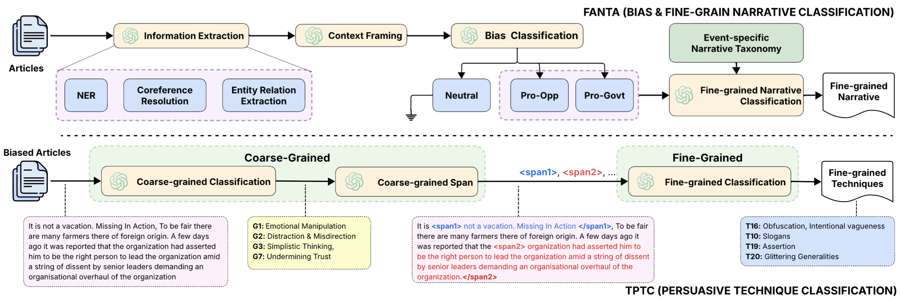

# INDI-PROP

This repository contains the INDI-PROP dataset along with the implementation of the FANTA & TPTC frameworks, as introduced in our paper:

📄 Preprint: [*Fine-grained Narrative Classification in Biased News Articles*](https://arxiv.org/abs/2512.03582)  
📅 Accepted at: Language Resources and Evaluation Conference (LREC), 2026  
📍 Palma, Mallorca (Spain) | 🗓 11–16 May 2026

## Overview

INDI-PROP is an ideologically grounded dataset for studying bias, narrative framing, and persuasive techniques in Indian news media. The resource is built around two major socio-political events:

1. CAA/NRC

2. Farmers' Protest 

Each article is annotated at multiple levels to capture:

1. Article-level bias

2. Fine-grained narratives

3. Persuasive techniques 

This enables analysis of how ideological framing and persuasion co-exist in media discourse.

## Dataset Statistics

| Component | Count |
|----------|------|
| Total Articles | 1,266 |
| Events Covered | 2 |
| Bias Labels | 3 (Pro-Gov, Pro-Opp, Neutral) |
| Fine-Grain Narrative Categories | 11 (CAA/NRC), 9 (Farmer's Protest) |
| Fine-Grain Persuasion Techniques Categories | 20 |

## Framework

We introduce two multi-hop reasoning frameworks to enable structured ideological analysis.

<p align="center">
  
</p>

FANTA performs article bias classification and narrative detection by modeling entities, relations, and contextual framing. And TPTC identifies persuasive strategies using a two-stage pipeline — first detecting conceptual persuasion categories, and then mapping them to fine-grained techniques.

## Dataset Access

The dataset is available for research purposes only.

To request access, please fill out the form below:

👉 [Google Form](https://docs.google.com/forms/d/e/1FAIpQLSegB-fPJ7H4Wsn2nGWzty2Ju5RcV8wDT9uYmjfvt6FADC4CcA/viewform?usp=dialog)

## Usage Policy

By requesting access, you agree to:

- Use the dataset strictly for academic or research purposes.

- Do not use it for political targeting, profiling, or manipulation.

- Cite the original paper in any published work.

The data reflects real-world political discourse and may contain ideological or sensitive content.
Users are encouraged to interpret and use it responsibly.

👉 The dataset is released to support transparency and computational media analysis.

## Citation

If you use this dataset or framework, please cite:

```bibtex
@article{afroz2025fine,
  title={Fine-grained Narrative Classification in Biased News Articles},
  author={Afroz, Zeba and Vardhan, Harsh and Bhakuni, Pawan and Punia, Aanchal and Kumar, Rajdeep and Akhtar, Md Shad},
  journal={arXiv preprint arXiv:2512.03582},
  year={2025}
}
```

## Contact

For questions or collaborations:

- **Zeba Afroz** — [zebaa@iiitd.ac.in](mailto:zebaa@iiitd.ac.in)
- **Harsh Vardhan** — [harsh25001@iiitd.ac.in](mailto:harsh25001@iiitd.ac.in)
- **Md. Shad Akhtar** — [shad.akhtar@iiitd.ac.in](mailto:shad.akhtar@iiitd.ac.in)

